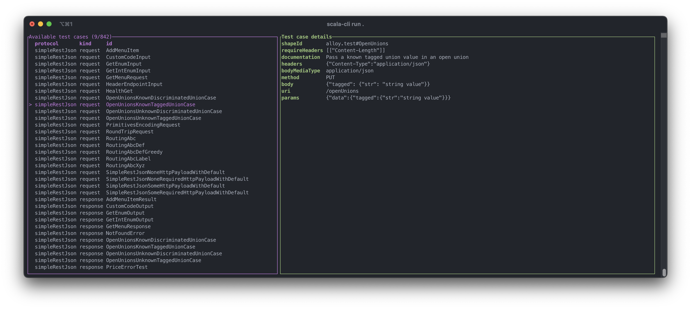

# smithy-test-tui

A small application for browsing [Smithy HTTP protocol compliance tests](https://smithy.io/2.0/additional-specs/http-protocol-compliance-tests.html) in the terminal, using [tui-scala](https://github.com/oyvindberg/tui-scala).

## Demo



## Usage

1. Create a `smithy-build.json` file (you can find an example in this repository)
2. Run the app using its Maven Central coordinates, e.g.

```bash
# with scala-cli
scala-cli run --dep org.polyvariant::smithy-test-tui:latest.release --main-class app

# or with Coursier
cs launch org.polyvariant:smithy-test-tui_3:latest.release
```

3. Browse with up/down arrows, exit with `q` or `ctrl+c`
